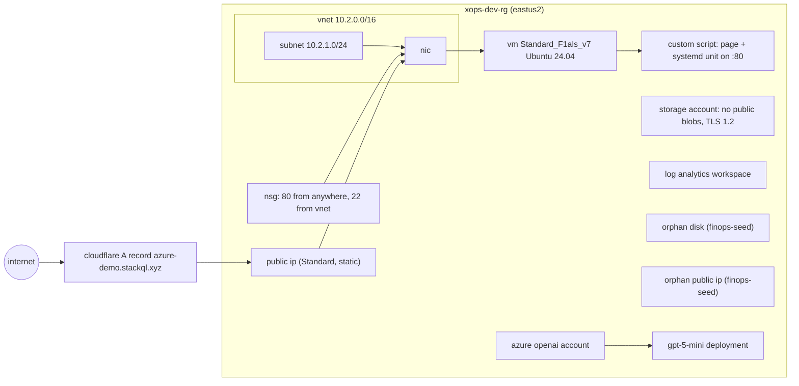

# xops: a service footprint on Azure with its edge in Cloudflare, as a stackql-deploy stack

One service (`azure-demo.stackql.xyz`) across two control planes: network, compute, storage, monitoring and Azure OpenAI on Azure, an A record on Cloudflare. Same manifest and resource files for `dev` and `prd`; per-environment values are the `values:` blocks in [stackql_manifest.yml](stackql_manifest.yml).



## Resources

| # | Resource | Provider resource | Flow | Notes |
|---|----------|-------------------|------|-------|
| 1 | `resource_group` | `azure.resource.resource_groups` | exists, create, statecheck | tagged with `global_tags` |
| 2 | `vnet` | `azure.network.virtual_networks` | exists, create, statecheck | CIDR per environment |
| 3 | `subnet` | `azure.network.subnets` | exists, create, statecheck | |
| 4 | `nsg` | `azure.network.network_security_groups` | createorupdate, statecheck | asserted on every build: drift in the rule set is put back |
| 5 | `public_ip` | `azure.network.public_ip_addresses` | exists, create, statecheck | exports `public_ip_address` for the edge |
| 6 | `nic` | `azure.network.network_interfaces` | exists, create, statecheck | subnet + public ip + nsg |
| 7 | `web_server` | `azure.compute.virtual_machines` | exists, create, statecheck | ssh key auth only, os disk deleted with the vm |
| 8 | `web_server_ext` | `azure.compute.virtual_machine_extensions` | exists, create, statecheck | CustomScript writes the page and a systemd unit (`python3 -m http.server 80`) |
| 9 | `storage_account` | `azure.storage.storage_accounts` | exists, create, statecheck, update | secure defaults; the update anchor patches drift back |
| 10 | `log_analytics` | `azure.log_analytics.workspaces` | exists, create, statecheck | PerGB2018, retention per environment |
| 11 | `orphan_disk` | `azure.compute.disks` | exists, create, statecheck | planted FinOps finding, `purpose=finops-seed` |
| 12 | `orphan_public_ip` | `azure.network.public_ip_addresses` | exists, create, statecheck | planted FinOps finding, `purpose=finops-seed` |
| 13 | `openai_account` | `azure.cognitive_services.accounts` | exists, create, statecheck | kind OpenAI, S0 (no fixed cost) |
| 14 | `openai_deployment` | `azure.cognitive_services.deployments` | exists, create, statecheck | gpt-5-mini, GlobalStandard |
| 15 | `dns_record` | `cloudflare.dns.zones_dns_records` | exists, create, statecheck, update | A record `host.domain` -> public ip |
| 16 | `conformance` | query | exports only | four checks across both planes, `footprint_ok` |

A build against a converged stack is reads only except the nsg (one PUT). `stackql-deploy test` runs the exists and statecheck queries and nothing else.

## Environment switches

| Prop | `dev` | `prd` |
|------|-------|-------|
| vnet / subnet CIDR | 10.2.0.0/16, 10.2.1.0/24 | 10.0.0.0/16, 10.0.1.0/24 |
| vm size | Standard_F1als_v7 | Standard_F2als_v7 |
| storage sku | Standard_LRS | Standard_GRS |
| log analytics retention | 30 days | 90 days |

The B series is capacity restricted for the demo subscription in eastus2 (`azure.compute.resource_skus` says `NotAvailableForSubscription`), hence the F-series v7 sizes.

## Usage

From the repo root, with `.env` filled in (see `.env.example`):

```bash
set -a; source .env; set +a

stackql-deploy build xops dev --dry-run        # render every query, run nothing
stackql-deploy build xops dev --show-queries   # build (idempotent)
stackql-deploy test xops dev                   # exists + statecheck only
stackql-deploy teardown xops dev               # reverse order
```

`stackql-deploy` reads `.env` from the working directory by default (`--env-file`), which feeds the manifest globals; the shell `source` is what puts the auth variables in the process environment for the stackql engine.

After the first build, `scripts/openai-env.sh` writes the Azure OpenAI endpoint, deployment and key into `.env` for the agents, and `scripts/vm.sh deallocate` stops the only hourly-billed resource between rehearsals (`scripts/vm.sh start` before the demo).

## Drift

`drift.sh` plants two changes an SRE would care about: an nsg rule allowing 22 from the internet, and public blob access on the storage account. The SRE agent finds both; `stackql-deploy build xops dev` puts both back and the conformance row goes back to `footprint_ok = true`.

## Notes on provider behaviour

- The subscription must have `Microsoft.OperationalInsights` and `Microsoft.CognitiveServices` registered before the Log Analytics workspace and the Azure OpenAI account can be created (otherwise a 409 `MissingSubscriptionRegistration`). `scripts/register-providers.sh` does it once.
- `exists` and `statecheck` queries filter the resource group's list with `name = ...` rather than using the per-resource `get` (which 404s when the resource is absent).
- The nsg statecheck compares the live rule count with the manifest's (`{{ security_rules | from_json | length }}`): props are passed to templates as JSON strings, so `length` without `from_json` is the string length.
- Booleans on Azure resources are sqlite integers rendered as `true`/`false`; statechecks compare with `IN (0, '0', 'false')` because the parser does not accept `CAST(... AS TEXT)`.
- `azure.cognitive_services.accounts` list (by resource group or subscription) returns an empty first page with a `nextLink` that the engine does not follow, so the account's queries use the per-resource get (`account_name = ...`): a 404 surfaces as a notice and zero rows, which `exists` reads as absent.
- A `query` resource's exports anchor must not contain `--` comment lines: the same SQL runs fine with `stackql exec`, but stackql-deploy reports `Exports query failed`. Keep comments above the anchor or in the manifest description.
- `json_each` over a provider column and CTE aliases inside a `UNION ALL` do not plan in the engine; the conformance query uses the flattened `azure.network.security_rules` subresource instead.
- Creating the vm and the Azure OpenAI account and deployment is asynchronous; their statechecks retry up to 18 times, 10 seconds apart.
- Deleting a Cognitive Services account soft-deletes it for 48 hours; a rebuild with the same name inside that window needs the account purged first (`azure.cognitive_services.deleted_accounts`).
